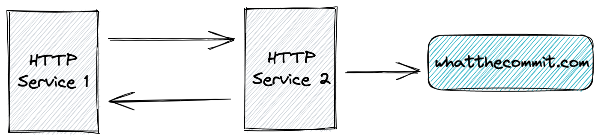

# Spring Boot OpenTelemetry Demo with Honeycomb

This project demonstrates distributed tracing with OpenTelemetry in a Spring Boot microservices environment, sending telemetry data to Honeycomb.io.

## Project Structure

The project consists of three services:

- `httpservice1`: Entry point service that makes calls to httpservice2
- `httpservice2`: Backend service that receives requests from httpservice1
- `load-generator`: A service that generates continuous test load by making requests to httpservice1



## OpenTelemetry Configuration

Both services are configured to send telemetry data to Honeycomb using the OpenTelemetry Java agent. The configuration is handled through environment variables in the `docker-compose.yml` file:

```yaml
environment:
  - OTEL_JAVAAGENT_ENABLED=true # Enables the OpenTelemetry Java agent
  - OTEL_EXPORTER_OTLP_ENDPOINT=https://api.honeycomb.io:443 # Honeycomb's OTLP endpoint
  - OTEL_EXPORTER_OTLP_PROTOCOL=http/protobuf # Protocol for sending data
  - OTEL_TRACES_EXPORTER=otlp # Use OTLP exporter for traces
  - OTEL_METRICS_EXPORTER=none # Disable metrics export
  - OTEL_SERVICE_NAME=<service-name> # Unique name for each service
  - OTEL_EXPORTER_OTLP_HEADERS=x-honeycomb-team=<your-api-key> # Honeycomb API key
```

## Building and Running

1. Build the Spring Boot applications:

```bash
./mvnw clean package
```

2. Build and start the Docker containers:

```bash
docker-compose build
docker-compose up
```

## Service Communication

- `httpservice1` runs on port 8080 and is configured to communicate with `httpservice2` using the environment variable:

```yaml
HTTPSERVICE2_ENDPOINT=http://httpservice2:8081
```

- `httpservice2` runs on port 8081 and receives requests from `httpservice1`
- `load-generator` automatically sends requests to `httpservice1` every 7 seconds, cycling through 20 different request IDs

## Load Generation

The load generator service automatically:

- Makes requests to httpservice1 at a rate of 1 request per 1-10 seconds
- Cycles through 20 different request IDs
- Runs continuously to generate a consistent stream of traces
- Helps demonstrate distributed tracing in action

## Viewing Traces in Honeycomb

1. The services automatically send trace data to Honeycomb using the configured API key
2. Log into your Honeycomb account at https://ui.honeycomb.io
3. Navigate to your environment to view the traces
4. You can see:
   - Distributed traces across both services
   - Service dependencies and relationships
   - Latency metrics and error rates
   - Custom attributes and context
